  

  <a href="https://malidev.zip">malidev.zip</a>
  &nbsp;·&nbsp;
  <a href="mailto:malideveloper@hotmail.com">email</a>
  &nbsp;·&nbsp;
  Türkiye

<h2 align="center"><code>whoami</code></h2>

I'm **mali**, a Computer Engineering student at Yalova University. I've been
interested in computers for as long as I can remember, and I keep exploring new
areas of software by turning ideas into working projects.

I use **AI** in my workflow and, honestly, some projects eventually become full-on
**vibe coding**. I still stay involved in the decisions, test the behavior, and try
to understand what ships. When needed, I reverse engineer software for security
research, compatibility, or undocumented systems. I've also built game mods, and
I'm gradually getting comfortable across the **full stack**.

 

  still learning · still building

<!-- If you found this, you read source. We would probably get along. -->
